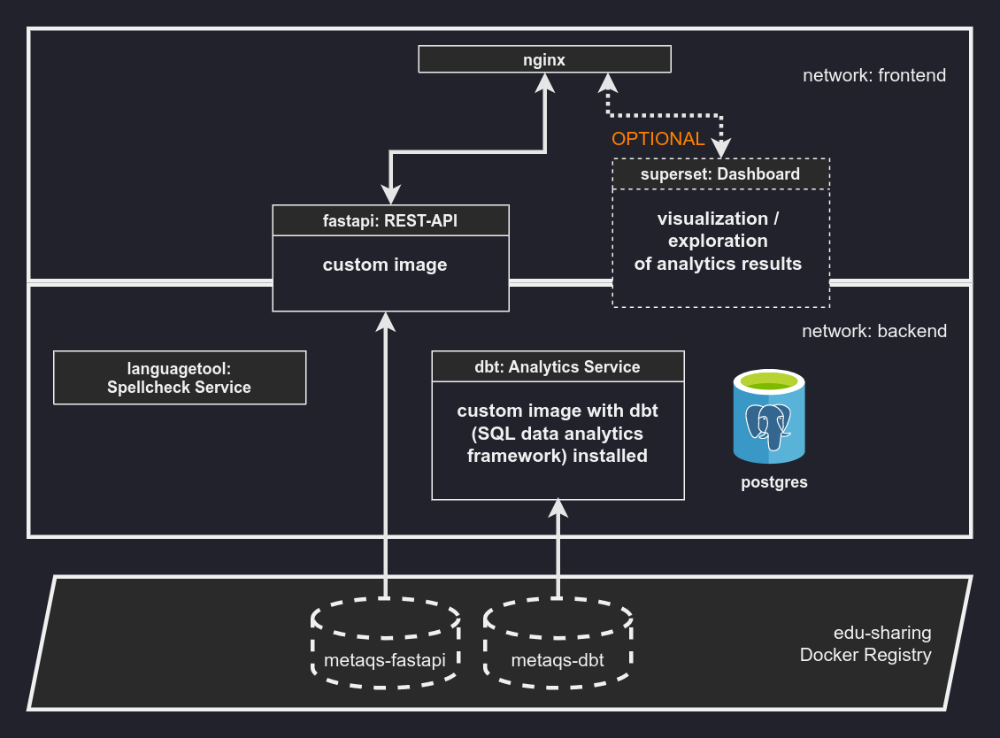

############
Architecture
############

Core services
=============

postgres
--------

- Uses postgres:14 docker image.

Environment variables::

    Variable	Value (recommended)
    POSTGRES_DB	analytics
    POSTGRES_USER	postgres
    POSTGRES_PASSWORD	postgres

These connection variables are shared with all services that need to connect to postgres (i.e. fastapi, dbt) (see docker-compose.yml).

nginx
-----

Find the nginx.conf at `nginx/nginx.conf.template` in the main repository.

Therein is also a `nginx-ssl.conf.template` for SSL setup.

Either of these is mounted into the nginx container (see docker-compose.yml).

API
---

Custom image based on tiangolo/uvicorn-gunicorn-fastapi.

Environment variables::

    Variable	Value	Description
    API_KEY		secures authenticated API endpoints
    ALLOWED_HOST	*
    POSTGRES_HOST	postgres	docker maps services in internal networks to service names
    LOG_LEVEL	info	options [error, warn, info, debug ]
    ELASTICSEARCH_URL		example: http://elastic-host:elastic-port

languagetool
------------

The service runs the erikvl87/languagetool docker image.

REST-API endpoints / openapi.spec are exposed / included in fastapi service.

dbt
---

Custom image based on stock python extended with the dbt data analytics framework.

Optional services
=================

superset
--------

One can optionally install a dashboard service to explore and visualize analytics results.

Certain visualizations are already preconfigured. See Dashboard setup for further details.

The service runs the latest Apache Superset docker image.

Documentation services

Sphinx
------

This project documentation can be exposed as a static website.
