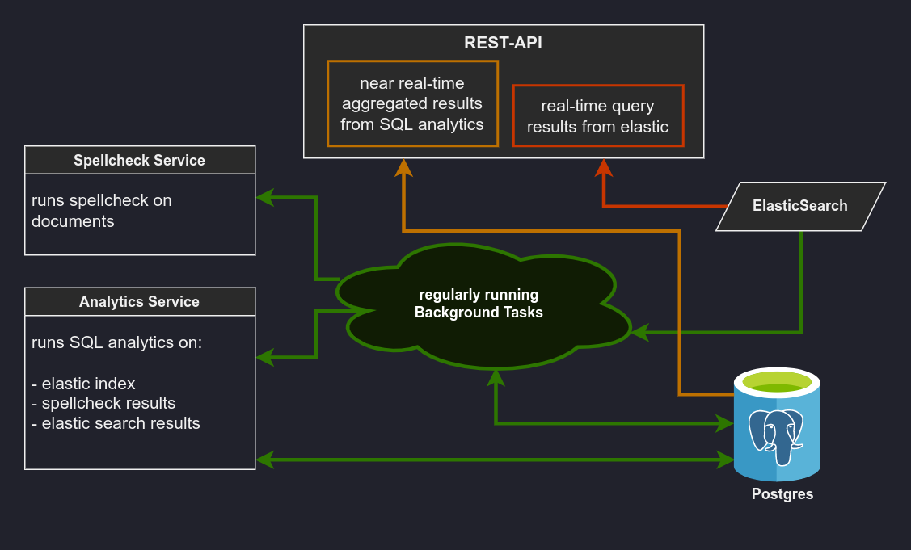

MetaQS analyzes data via elasticsearch queries and yields data about empty metadata. It is used mostly as a just-in-time
analytics tool.

Documentation Links
-------------------

- [docker base image](https://github.com/tiangolo/uvicorn-gunicorn-fastapi-docker)
- [async pg client library](https://magicstack.github.io/asyncpg/current/index.html)
- [sqlalchemy (sync pg client)](https://docs.sqlalchemy.org/en/14/tutorial/index.html)
- [fastapi](https://fastapi.tiangolo.com/tutorial/)
- [pydantic](https://pydantic-docs.helpmanual.io/)
- [elasticsearch DSL query library](https://elasticsearch-dsl.readthedocs.io/en/latest/index.html)
- [glom - pythonic data parsing](https://glom.readthedocs.io/en/latest/index.html)
- [python http client](https://www.python-httpx.org/quickstart/)
- [python jsonrpc client](https://www.jsonrpcclient.com/en/stable/index.html)
- [python polling library](https://polling2.readthedocs.io/en/latest/index.html)

How to add a new endpoint
-------------------------

If it is a realtime endpoint:

Add endpoint to respective router in `app/api/v1/realtime/api.py`

Add Elasticsearch query to CRUD in `app/crud/`

PostgreSQL:
- not needed

dbt:
- not needed

How to structure an ES query
----------------------------

###############
Dev environment
###############

Deploy docker-compose.yml to virtual machine.

Setting up VM
-------------

Install docker::

    sudo apt-get update
    sudo apt-get install \
        ca-certificates \
        curl \
        gnupg \
        lsb-release
    curl -fsSL https://download.docker.com/linux/ubuntu/gpg | sudo gpg --dearmor -o /usr/share/keyrings/docker-archive-keyring.gpg
    echo \
      "deb [arch=$(dpkg --print-architecture) signed-by=/usr/share/keyrings/docker-archive-keyring.gpg] https://download.docker.com/linux/ubuntu \
      $(lsb_release -cs) stable" | sudo tee /etc/apt/sources.list.d/docker.list > /dev/null
    sudo apt-get update
    sudo apt-get install docker-ce docker-ce-cli containerd.io

Use docker as root::

    sudo groupadd docker
    sudo usermod -aG docker $USER

Install docker-compose::

    sudo curl -L "https://github.com/docker/compose/releases/download/1.29.2/docker-compose-$(uname -s)-$(uname -m)" -o /usr/local/bin/docker-compose
    sudo chmod +x /usr/local/bin/docker-compose
    docker-compose --version  # Test the installation

Preparing containers
--------------------

Use::

    docker-compose up

to download images for dbt, postgreSQL.

Fast API

DBT::

    docker-compose build dbt
    docker push community.docker.edu-sharing.com/metaqs-dbt:latest

Preparing SQL
-------------

Launch postgres container and connect to `analytics` database::

    docker-compose up -d postgres
    docker-compose exec -u postgres postgres psql -d analytics

List all tables::

    \l
    \dt

Get all relevant tables::

    SELECT * FROM pg_catalog.pg_tables
    WHERE schemaname != 'information_schema' AND
    schemaname != 'pg_catalog';

Create necessary tables::

    CREATE TABLE [raw.collections]

Launch environment
------------------

Nginx must be configured with letsencrypt. Run::

    ./init_letsencrypt.sh

enter your desired domain. You need write permissions on that domain::

    docker-compose up

Pre-Commit Hooks
----------------

Install pre-commit hooks::

    cd src
    pre-commit install

CertBot
-------

Run::

    ./init_letsencrypt.sh

If build folders are missing, run::

    mkdir src
    mkdir dbt

and run init again.

Use domain corresponding to the IP of the VM, e.g.,::

    cXYZ-UVW.cloud.gwdg.de

Add `.env` file to VM according to `.env.example`. Take care to add the corresponding domain in the `.env`.
